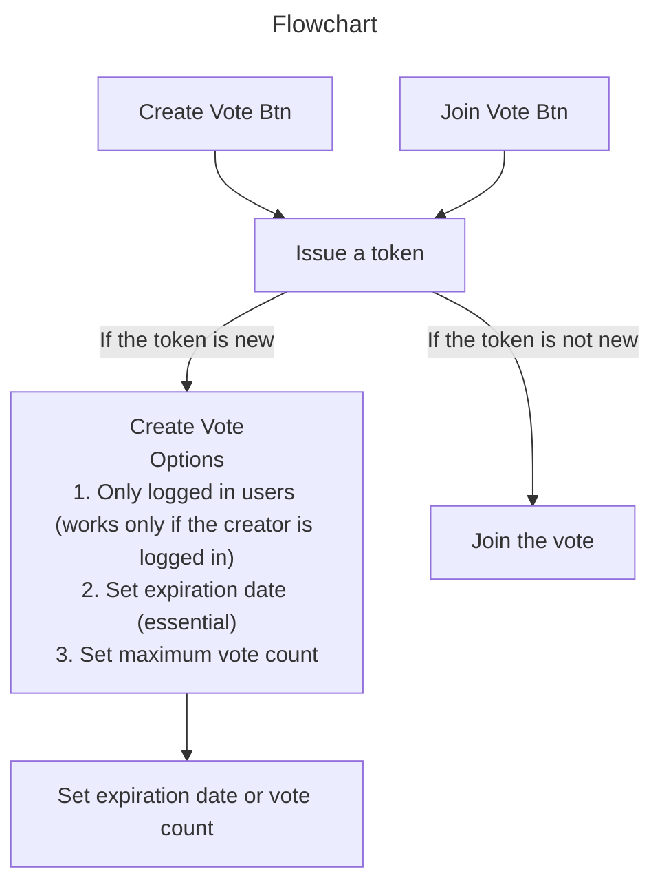

## Client

- Vite
- React
- Mantine
- TypeScript

## Server

- Go
- Chi
- Postgresql



```sql
CREATE TABLE users (
    id SERIAL PRIMARY KEY,
    username VARCHAR(50) UNIQUE NOT NULL,
    email VARCHAR(100) UNIQUE NOT NULL,
    password_hash VARCHAR(100) NOT NULL,
    created_at TIMESTAMP DEFAULT CURRENT_TIMESTAMP
);

CREATE TABLE polls (
    id SERIAL PRIMARY KEY,
    title VARCHAR(100) NOT NULL,
    description TEXT,
    creator_id INT REFERENCES users(id) ON DELETE CASCADE,
    created_at TIMESTAMP DEFAULT CURRENT_TIMESTAMP
);

CREATE TABLE options (
    id SERIAL PRIMARY KEY,
    option_text TEXT NOT NULL,
    poll_id INT REFERENCES polls(id) ON DELETE CASCADE,
    created_at TIMESTAMP DEFAULT CURRENT_TIMESTAMP
);

CREATE TABLE votes (
    id SERIAL PRIMARY KEY,
    user_id INT REFERENCES users(id) ON DELETE CASCADE,
    option_id INT REFERENCES options(id) ON DELETE CASCADE,
    created_at TIMESTAMP DEFAULT CURRENT_TIMESTAMP
);
```
