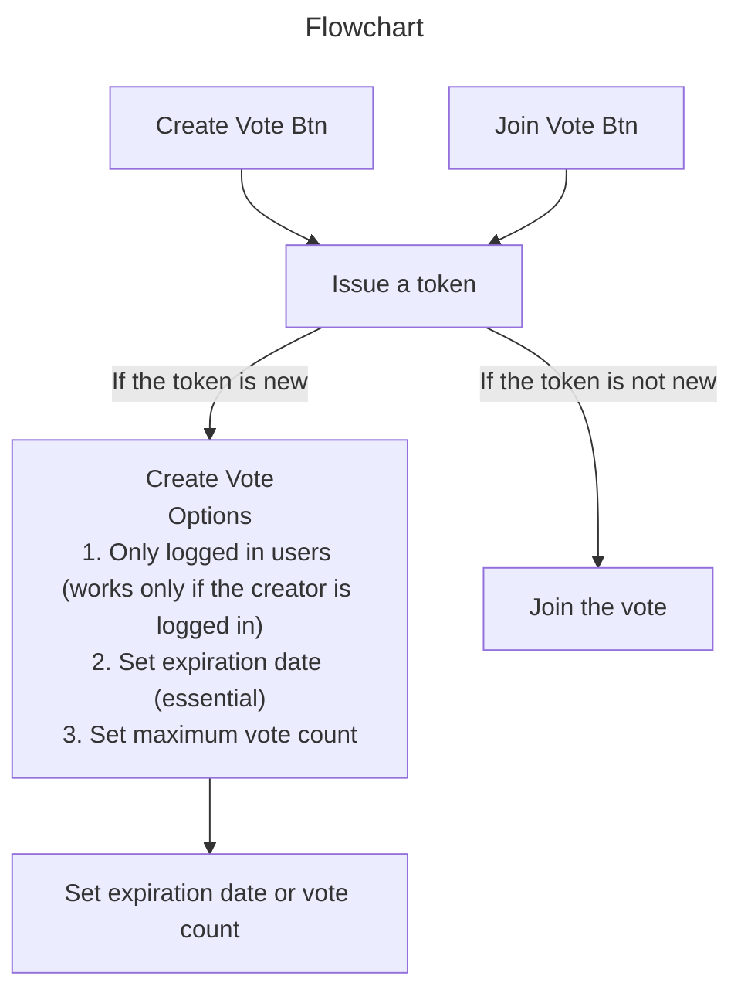

## Todos

- [x] Add loading when creating poll
- [x] Add loading when casting vote
- [x] Set expiration date
- [x] Set visibility related to expiration date
- [ ] Add comments to poll

```mermaid
---
title: Flowchart
---
flowchart TD
  CreateBtn[Create Vote Btn] --> IssueKey[Issue a token]
  JoinBtn[Join Vote Btn] --> IssueKey
  IssueKey --If the token is new--> CreateVote["`
  Create Vote
  Options
    1. Only logged in users (works only if the creator is logged in)
    2. Set expiration date (essential)
    3. Set maximum vote count
  `"]
  IssueKey --If the token is not new--> Vote[Join the vote]
  CreateVote --> Expiration[Set expiration date or vote count]
```
